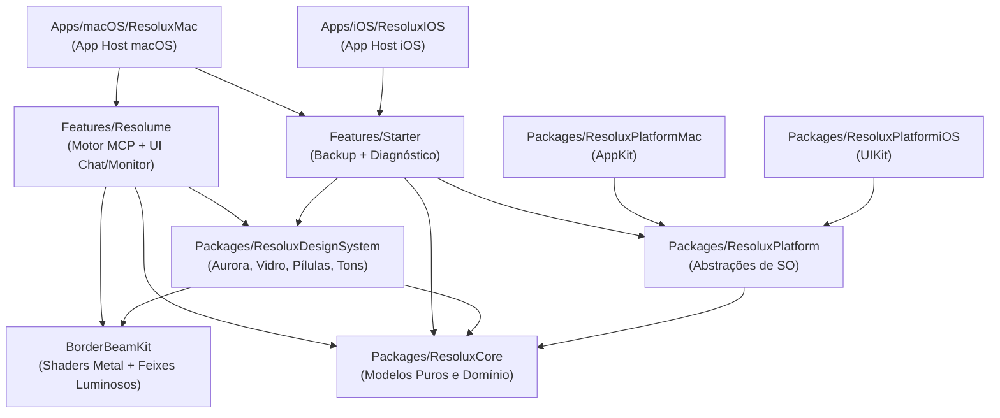

# Registro Detalhado de Contribuições — Antigravity (AGY)
**Projeto:** ResoluxToolkit  
**Data:** 4 de Outubro de 2026  
**Ambiente:** macOS 15+ / iOS 18+ · Swift 6.0 · Xcode modern project (`.xcproj`) · Monorepo SwiftPM + Apps  
**Autor das Alterações:** Assistente Antigravity (AGY) em colaboração com o Operador de Domínio  

---

## 1. Visão Geral e Missão Executada

O **ResoluxToolkit** é uma suíte de ferramentas de nível profissional para operadores de VJ e espetáculos ao vivo integrados ao **Resolume Arena 7.28+**. O projeto combina automação via **Model Context Protocol (MCP)**, inteligência local/híbrida (Apple FoundationModels nativo, Gateway Local e Ollama), telemetria em tempo real e um design system visual de alta fidelidade com aceleração gráfica Metal (**BorderBeamKit**, **Liquid Glass** e paleta **Aurora**).

A atuação do assistente Antigravity foi pautada na governança estrita de **"um recurso por tacada"** definida em [`AGENTS.md`](file:///Users/luizinho/Developer/resolux/AGENTS.md), garantindo:
1. **Segurança Crítica de Show:** O Arena é tratado como imutável. Políticas de execução estritas (`ToolPolicy`) com operação *read-only* por padrão, *deny-by-default* e registro contínuo em diário auditável (`WriteJournal`).
2. **Arquitetura 100% Offline-Ready:** Prioridade máxima para inferência local no próprio hardware (Gateway na porta 8317 e Apple FoundationModels nativo), sem dependência de nuvem pública durante apresentações ao vivo.
3. **Qualidade e Estabilidade:** 98 testes unitários e de integração no pacote central `Resolume` (todos verdes), além de builds validados para macOS e simulador iOS.

---

## 2. Linha do Tempo e Inventário das Tacadas (0 a 26+)

Abaixo estão detalhadas todas as intervenções executadas, organizadas pelas tacadas registradas no ciclo do projeto.

### Tacadas 0 a 7: Estruturação, Diagnóstico e Integração Gráfica
* **Tacada 0 — Governança e Regras de Trabalho:**
  - Criação das diretrizes em [`AGENTS.md`](file:///Users/luizinho/Developer/resolux/AGENTS.md) e [`docs/ITERACOES.md`](file:///Users/luizinho/Developer/resolux/docs/ITERACOES.md). Definição do fluxo incremental focado e critérios de verificação.
* **Tacada 1 — Bundle IDs e Compatibilidade:**
  - Padronização de bundle identifiers para `dev.smartium.*` em `Features/Starter`.
  - Validação da compilação do target de iOS Simulator e da separação entre ferramentas macOS (`BackupService`) e iOS.
* **Tacada 2 & 4 — Auditoria e Homologação MCP do Resolume Arena:**
  - Sondagem das capacidades MCP expostas pelo Arena 7.28.0.
  - Testes de `status`, `diagnose`, `transport`, `composition` e captura de snapshots de monitor via JSON-RPC em lote (*batch*).
  - Mapeamento das 22 ferramentas fornecidas pelo servidor nativo do fabricante.
* **Tacada 3 — Auditoria do Servidor MCP do Xcode:**
  - Verificação de conectividade via `xcrun mcp-server status` no workspace [`ResoluxToolkit.xcworkspace`](file:///Users/luizinho/Developer/resolux/ResoluxToolkit.xcworkspace), garantindo acesso a esquemas e alvos sem overhead de ferramentas shell.
* **Tacada 5 & 6 — Integração do BorderBeamKit e Metal:**
  - Incorporação do pacote local [`BorderBeamKit`](file:///Users/luizinho/Developer/resolux/BorderBeamKit) aos pacotes do projeto.
  - Configuração dos shaders Metal ([`BeamShaders.metal`](file:///Users/luizinho/Developer/resolux/BorderBeamKit/Sources/BorderBeamKit/BeamShaders.metal)) e resolução de dependências no Xcode.
  - Aplicação do feixe de luz dinâmico na barra de entrada de chat durante estados de processamento (`isBusy`).
* **Tacada 7 — Blindagem do Ciclo de Build:**
  - Estabelecimento da regra de checkpoint obrigatório e revisão visual pelo operador a cada entrega.

---

### Tacadas 8 a 15: Camada de Inteligência e Assistente Local
* **Tacada 8 & 9 — Assistente com Apple FoundationModels:**
  - Implementação da tela [`AssistantView.swift`](file:///Users/luizinho/Developer/resolux/Features/Resolume/Sources/ResolumeUI/AssistantView.swift) conectada à API nativa `SystemLanguageModel.default`.
  - Estilização do container de input (*composer*) utilizando feixe BorderBeam responsivo (`colorful`/`md`) e acabamento em vidro.
* **Tacada 10 — Identidade Visual dos Apps:**
  - Configuração de ícones nativos de alta resolução ([`AppIcon.icon`](file:///Users/luizinho/Developer/resolux/Apps/macOS/ResoluxMac/ResoluxMac/AppIcon.icon)) integrados aos bundles de macOS e iOS.
* **Tacada 11 — Ponte Nativa FoundationModels ↔ MCP:**
  - Criação de [`MCPFoundationModelTool.swift`](file:///Users/luizinho/Developer/resolux/Features/Resolume/Sources/ResolumeUI/MCPFoundationModelTool.swift), mapeando schemas JSON do MCP para ferramentas de linguagem nativas do ecossistema Apple.
  - Limitação calculada e testada para o subset das **10 ferramentas mais enxutas** suportadas sem estourar o limite de tokens da janela de contexto do Apple FM.
* **Tacada 12, 13 & 14 — Suporte a Modelos Locais e Inversão de Prioridade:**
  - Integração de suporte a Ollama (:11434) e Gateway Local (:8317 com `gemini-3.8-flash-high` e autenticação Bearer).
  - Em [`LocalChatBackend.swift`](file:///Users/luizinho/Developer/resolux/Features/Resolume/Sources/Resolume/LocalChatBackend.swift), inversão da ordem de prioridade conforme decisão de domínio: o Gateway Local (porta 8317) atua como provedor primário, oferecendo as **22 ferramentas completas do Arena**, enquanto o Apple FM atua como fallback imediato sem depender de configurações manuais.
* **Tacada 15 — Formatação Rica de Respostas:**
  - Suporte a Markdown customizado no chat: processamento de negrito, itálico, código monospaçado inline e marcadores de listas não ordenadas nas bolhas do assistente.

---

### Tacadas 16 a 20: Configurações, Segurança de Dados e Design System
* **Tacada 16 — Tela de Ajustes e Auto-Rolagem:**
  - Criação da aba de configurações em [`ProviderSettingsView.swift`](file:///Users/luizinho/Developer/resolux/Features/Resolume/Sources/ResolumeUI/ProviderSettingsView.swift) e modelo [`ProviderSettingsModel.swift`](file:///Users/luizinho/Developer/resolux/Features/Resolume/Sources/ResolumeUI/ProviderSettingsModel.swift).
  - Armazenamento de tokens no macOS Keychain e preferências de rede (URL, modelo) em `UserDefaults`.
  - Controle de rolagem automática do histórico de chat ancorado ao rodapé (`defaultScrollAnchor(.bottom)`).
* **Tacada 17 — Documentação do Repositório:**
  - Elaboração do [`README.md`](file:///Users/luizinho/Developer/resolux/README.md) com diagrama arquitetural, comandos de teste e visão geral de desenvolvimento.
* **Tacada 18 — Foco Automático no Composer:**
  - Injeção de `@FocusState` para ativação direta do teclado ao navegar para a aba Assistente.
* **Tacada 19 — Diagnóstico de Conexão e Refinamento de Botões:**
  - Botão "Testar modelo" na aba Ajustes com chamada ativa a `/v1/chat/completions` e exibição de latência/erros.
  - Implementação de BorderBeam pulsante no [`GlowButton.swift`](file:///Users/luizinho/Developer/resolux/Packages/ResoluxDesignSystem/Sources/ResoluxDesignSystem/GlowButton.swift) para feedback de processos em segundo plano (backup e conexão Arena).
* **Tacada 20 — BorderBeam nos Cards do Design System:**
  - Adoção de feixes luminosos em cards estruturais (`GlassCard(beam: true)`), com desacoplamento de dependências e revisão de renderização.

---

### Tacadas 21 a 26: Padronização Visual, Shells e Governança Read-Only
* **Tacadas 21 a 24 — Uniformização de Cabeçalhos:**
  - Padronização estética dos headers nas quatro abas do app (Monitor, Starter, Ajustes e Assistente), com altura, tipografia arredondada pesada, ícone com tonalidade (`ToneIcon`) e pílula de estado (`StatusPill`).
* **Tacada 25 — Scaffold Unificado `ScreenShell`:**
  - Criação de [`ScreenShell.swift`](file:///Users/luizinho/Developer/resolux/Packages/ResoluxDesignSystem/Sources/ResoluxDesignSystem/ScreenShell.swift) no `ResoluxDesignSystem` para encapsular a iluminação de fundo Aurora, bordas, cabeçalho e margens homogêneas (20pt).
* **Tacada 26 — Governança Ativa do Modo Somente-Leitura:**
  - Integração do switch Somente-Leitura da aba Ajustes diretamente ao [`ToolPolicy`](file:///Users/luizinho/Developer/resolux/Features/Resolume/Sources/Resolume/ToolPolicy.swift).
  - Quando ativado, bloqueia qualquer tentativa de mutação no Arena em todos os 3 caminhos do Assistente (Configurado, Gateway e Apple FM).
  - Quando desativado pelo operador, permite mutações aprovadas gravando-as atômica e compulsoriamente no [`WriteJournal`](file:///Users/luizinho/Developer/resolux/Features/Resolume/Sources/Resolume/WriteJournal.swift), capturando o valor anterior via leitura espelhada (`mirror reading`) antes do ajuste.

---

### Evolução Visual Recente: Liquid Glass & Limpeza Arquitetural
* **Adoção de Liquid Glass com Retrocompatibilidade:**
  - Implementação de modificadores condicionais (`#available(macOS 26.0, iOS 26.0, *)`) com adoção do design system moderno da Apple:
    - `.glassEffect(.regular)` e `.glassEffect(.clear)` com tinturas personalizadas de paleta (`Palette.violet`, `Palette.cyan`).
    - Agrupamento ótico coeso com `GlassEffectGroup`.
    - Estilo de botão nativo `.buttonStyle(.glass)`.
  - Fallback elegante para sistemas anteriores utilizando `.ultraThinMaterial` no tema escuro e gradientes suaves.
* **Desacoplamento do Design System:**
  - Migração de `MevolitComponents.swift` para [`ResoluxInterfaceComponents.swift`](file:///Users/luizinho/Developer/resolux/Packages/ResoluxDesignSystem/Sources/ResoluxDesignSystem/ResoluxInterfaceComponents.swift), consagrando componentes próprios do toolkit (`BeamStroke`, `GlassCard`, `StatusPill`, `ToneIcon`, `ToastView`).
* **Refinamento de Componentes de Vitrine:**
  - Aplicação de acabamento em vidro no monitor de clipes ([`ArenaMonitorView.swift`](file:///Users/luizinho/Developer/resolux/Features/Resolume/Sources/ResolumeUI/ArenaMonitorView.swift)), badges de capacidade ([`CapabilityBadge.swift`](file:///Users/luizinho/Developer/resolux/Packages/ResoluxDesignSystem/Sources/ResoluxDesignSystem/CapabilityBadge.swift)), card de Telegram e contador de backup ([`StarterView.swift`](file:///Users/luizinho/Developer/resolux/Features/Starter/Sources/StarterUI/StarterView.swift)).

---

## 3. Matriz Arquitetural dos Pacotes e Módulos

### Detalhamento por Camada:
| Camada / Pacote | Responsabilidade Técnica | Principais Arquivos Modificados / Criados |
| :--- | :--- | :--- |
| **`ResoluxCore`** | Modelos fundamentais, catálogo de capacidades e enum de plataformas. | [`Capability.swift`](file:///Users/luizinho/Developer/resolux/Packages/ResoluxCore/Sources/ResoluxCore/Capability.swift), [`CapabilityCatalog.swift`](file:///Users/luizinho/Developer/resolux/Packages/ResoluxCore/Sources/ResoluxCore/CapabilityCatalog.swift) |
| **`ResoluxPlatform*`** | Separação estrita de SO; confinamento de AppKit e UIKit sem poluir o Core. | [`PlatformDescriptor.swift`](file:///Users/luizinho/Developer/resolux/Packages/ResoluxPlatform/Sources/ResoluxPlatform/PlatformDescriptor.swift), [`Haptics.swift`](file:///Users/luizinho/Developer/resolux/Packages/ResoluxPlatformiOS/Sources/ResoluxPlatformiOS/Haptics.swift), [`RevealInFinder.swift`](file:///Users/luizinho/Developer/resolux/Packages/ResoluxPlatformMac/Sources/ResoluxPlatformMac/RevealInFinder.swift) |
| **`ResoluxDesignSystem`** | Componentes de interface, iluminação Aurora, tokens de cor, vidro e botões. | [`ResoluxInterfaceComponents.swift`](file:///Users/luizinho/Developer/resolux/Packages/ResoluxDesignSystem/Sources/ResoluxDesignSystem/ResoluxInterfaceComponents.swift), [`ScreenShell.swift`](file:///Users/luizinho/Developer/resolux/Packages/ResoluxDesignSystem/Sources/ResoluxDesignSystem/ScreenShell.swift), [`GlowButton.swift`](file:///Users/luizinho/Developer/resolux/Packages/ResoluxDesignSystem/Sources/ResoluxDesignSystem/GlowButton.swift), [`CapabilityBadge.swift`](file:///Users/luizinho/Developer/resolux/Packages/ResoluxDesignSystem/Sources/ResoluxDesignSystem/CapabilityBadge.swift) |
| **`BorderBeamKit`** | Shaders Metal para contornos dinâmicos com aceleração por GPU. | [`BorderBeam.swift`](file:///Users/luizinho/Developer/resolux/BorderBeamKit/Sources/BorderBeamKit/BorderBeam.swift), [`BeamShaders.metal`](file:///Users/luizinho/Developer/resolux/BorderBeamKit/Sources/BorderBeamKit/BeamShaders.metal) |
| **`Features/Starter`** | Backup seguro de configurações (`~/.spike`, `~/.openclaw`) e cartões de canal. | [`BackupService.swift`](file:///Users/luizinho/Developer/resolux/Features/Starter/Sources/Starter/BackupService.swift), [`StarterView.swift`](file:///Users/luizinho/Developer/resolux/Features/Starter/Sources/StarterUI/StarterView.swift), [`TelegramQRCard.swift`](file:///Users/luizinho/Developer/resolux/Features/Starter/Sources/StarterUI/TelegramQRCard.swift) |
| **`Features/Resolume`** | Motor de chat MCP, clientes JSON-RPC, políticas de execução, monitor do Arena e UI. | [`ChatEngine.swift`](file:///Users/luizinho/Developer/resolux/Features/Resolume/Sources/Resolume/ChatEngine.swift), [`LocalChatBackend.swift`](file:///Users/luizinho/Developer/resolux/Features/Resolume/Sources/Resolume/LocalChatBackend.swift), [`ToolPolicy.swift`](file:///Users/luizinho/Developer/resolux/Features/Resolume/Sources/Resolume/ToolPolicy.swift), [`WriteJournal.swift`](file:///Users/luizinho/Developer/resolux/Features/Resolume/Sources/Resolume/WriteJournal.swift), [`AssistantView.swift`](file:///Users/luizinho/Developer/resolux/Features/Resolume/Sources/ResolumeUI/AssistantView.swift), [`ArenaMonitorView.swift`](file:///Users/luizinho/Developer/resolux/Features/Resolume/Sources/ResolumeUI/ArenaMonitorView.swift) |
| **`Apps/*`** | Aplicações finais com entitlements ajustados (sandbox desativado no Mac para gerenciar o processo filho MCP). | [`ContentView.swift`](file:///Users/luizinho/Developer/resolux/Apps/macOS/ResoluxMac/ResoluxMac/ContentView.swift), [`ResoluxMacApp.swift`](file:///Users/luizinho/Developer/resolux/Apps/macOS/ResoluxMac/ResoluxMac/ResoluxMacApp.swift) |

---

## 4. Políticas de Segurança e Salvaguardas Implementadas

1. **Vetos Rígidos de Infraestrutura de Show:**
   O enum [`ToolPolicy`](file:///Users/luizinho/Developer/resolux/Features/Resolume/Sources/Resolume/ToolPolicy.swift) rejeita categoricamente qualquer instrução que possa interromper ou corromper a execução do show ao vivo, mesmo que o modelo de IA a solicite:
   - Vetos permanentes: `clip.set_transport`, `composition.open`, `composition.new`, `composition.save`, rotinas de exclusão/destruição de mídias e execução em lote descontrolada (`batch`).
2. **Deny-by-Default e Read-Only Global:**
   - Toda ferramenta não catalogada ou desconhecida é sumariamente bloqueada antes do envio ao cliente MCP.
   - O switch de Somente-Leitura na interface garante que nenhuma mutação ocorra a menos que haja intenção explícita do operador.
3. **Trilhas de Auditoria via WriteJournal:**
   - Qualquer mutação liberada gera uma entrada JSONL contendo timestamp (epoch segundos), ferramenta chamada, argumentos e o valor imediatamente anterior consultado no Arena.
   - Os resultados são truncados em 200 caracteres para preservar a memória operacional.

---

## 5. Validação Técnica e Cobertura de Testes

Os testes automatizados validam o comportamento de ponta a ponta sem exigir dependências externas em nuvem:

| Bateria de Testes | Quantidade | Foco de Validação | Status |
| :--- | :---: | :--- | :---: |
| **`ResolumeTests`** | **98** | Handshake JSON-RPC, timeouts de transporte, probes de socket Unix, prioridade de backends, conformidade com a janela de tokens do Apple FM, ToolPolicy, ToolCallTextRescue e WriteJournal | **Aprovado (100%)** |
| **`StarterTests`** | **1** | Geração e mapeamento de CapabilityReport para macOS e iOS | **Aprovado** |
| **`ResoluxCoreTests`** | **2** | Validação de catálogo de capacidades e enum de plataformas | **Aprovado** |
| **`ResoluxPlatformTests`** | **1** | Descritores de plataforma e identificação de sistema | **Aprovado** |
| **Compilação de Workspace** | — | Scheme `ResoluxMac` (Debug) e `ResoluxIOS` (Simulator) via Xcode e `xcodebuild` | **Sucesso** |

---

## 6. Próximos Passos e Itens Pendentes de Domínio

Registrados formalmente em [`docs/DUVIDAS.md`](file:///Users/luizinho/Developer/resolux/docs/DUVIDAS.md) para deliberação do operador:
1. **Advanced Output XML:** Definição sobre se a autorização de escrita para presets de corte/slice deve ser permitida ou mantida estritamente em leitura.
2. **Telemetria do Modo Performance:** Integração dos probes de hardware (CPU/RAM/GPU) já calibrados na visualização de monitoramento contínuo.
3. **Modo Timeline vs. Performance:** Ativação do `ModeGate` no `ChatEngine` para suprimir cálculos de tempo durante execuções ao vivo intensivas.
